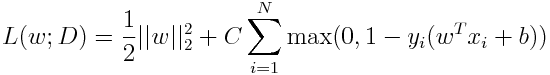
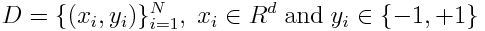
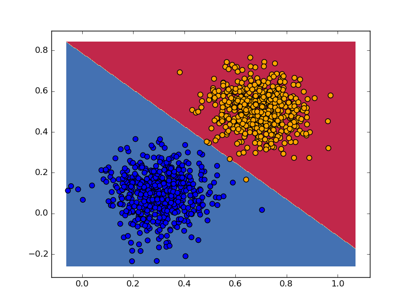

Tensorflow Linear SVM
===

A demonstration of how you can use [TensorFlow](http://www.tensorflow.org/) to
implement a standard L2-regularized support vector machine (SVM) in primal form. 

`linear_svm.py` optimizes the following SVM cost using gradient descent: 

where 

The first part of the cost function, i.e. the regularization part, is
implemented by the `regularization_loss` expression, and the second part is
implemented by the `hinge_loss` expression in the code. 

Run the code using

`python linear_svm.py --train linearly_separable_data.csv --svmC 1 --verbose
True --num_epochs 10`

On a linearly separable, 2D data, the code gives the following decision
boundary: 

The code here is inspired by the repository
[try-tf](https://github.com/jasonbaldridge/try-tf).
